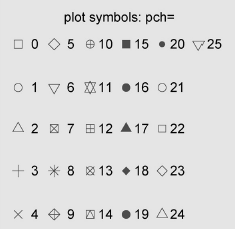
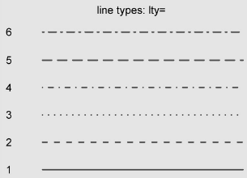

# Notes 1

- Inner Product: &nbsp; `%*%`
- Outer Product: &nbsp; `%o%`
- remove variables: &nbsp; `rm(object)`
- remove all: &nbsp; `rm(list = ls())`
- Styles: 
    - pch
    
    

    - lty

    

    - cex: the size of text. default 1. 
    - col: color. 
    - bg: background color. 
    - font: 1 = regular, 2 = bold, 3 = italic, 4 = bold italic, 5 = character

- Value of determinant: &nbsp; `det(A)`
- Inverse: &nbsp; `solve(A)`
- **Orthogonal Projection**
    - y's orthogonal projection on x. x is a matrix, y is a vector. 
    - `x %*% solve(t(x) %*% x) %*% t(x) %*% y`
