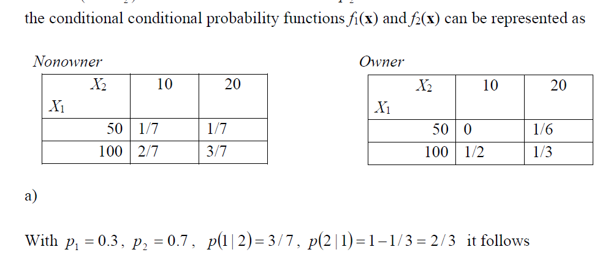

[Back to menu](/README.md)

<h1 id = "0">Notes 10</h1>

- Exercise 5



Remember that you should not use the original probability! You need to calculate the **conditional probability** instead! 

- Classification, calculate confusion table and APER

```
predict_function = function(pred_data, S1, S2, mu1, mu2, actu_label) {
    n1 = length(male_data[, 1])
    n2 = length(female_data[, 1])
    S_p = (n1 - 1) / (n1 + n2 - 2) * S1 + (n2 - 1) / (n1 + n2 - 2) * S2

    lhs = as.matrix(pred_data) %*% solve(S_p) %*% (mu1 - mu2) -
    (0.5 * t(mu1 - mu2) %*% solve(S_p) %*% (mu1 + mu2))[1, 1]

    label = rep(0, length(pred_data[, 1]))
    label[which(lhs < log(female_portion / male_portion))] = 1

    confusion = matrix(rep(0, 4), 2, 2)
    confusion[1, 1] = length(which(label + actu_label == 0))
    confusion[2, 2] = length(which(label + actu_label == 2))
    confusion[1, 2] = length(which(label - actu_label == 1))
    confusion[2, 1] = length(which(label - actu_label == -1))
    
    print(confusion)

    aper = (confusion[1, 2] + confusion[2, 1]) / length(pred_data[, 1])
    print(aper)
}
predict_function(X[, 1:2], cov_male[1:2, 1:2], cov_female[1:2, 1:2], male_mean[1:2], female_mean[1:2], X["sex"])
```

---

[Back to Top](#0)