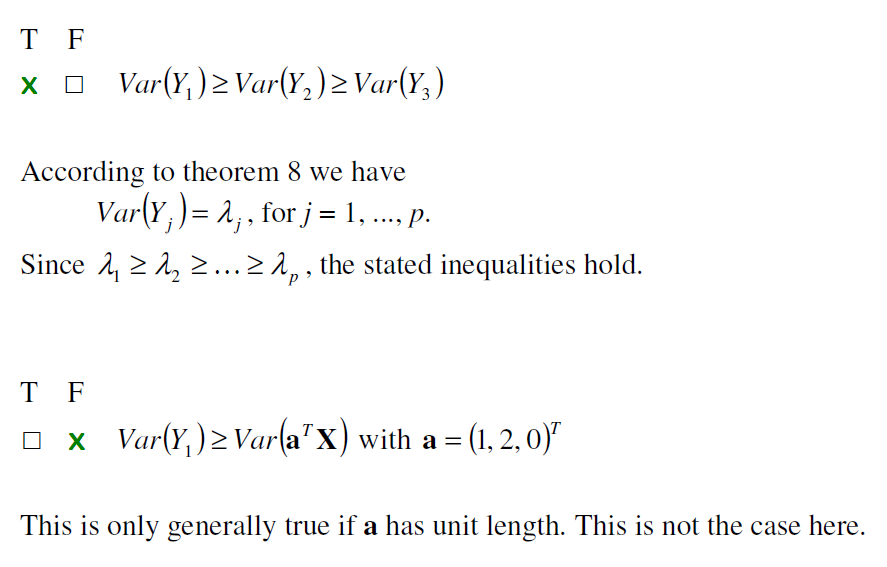
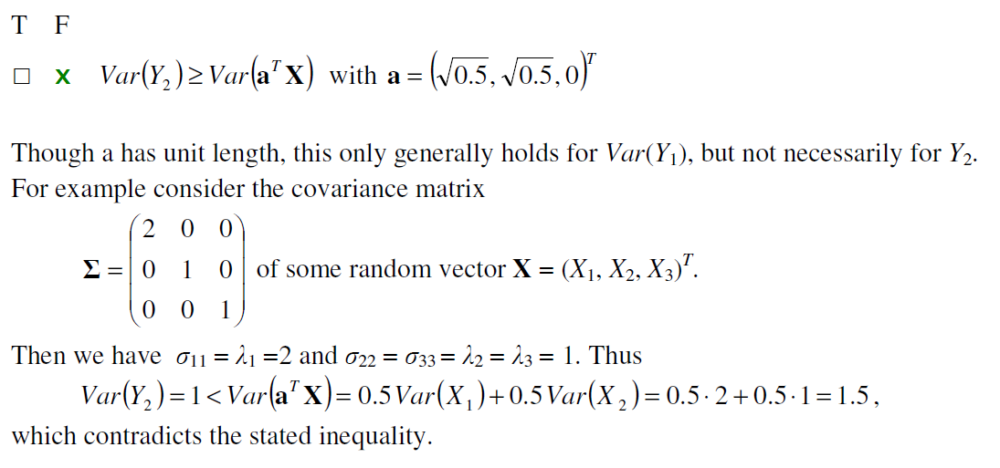
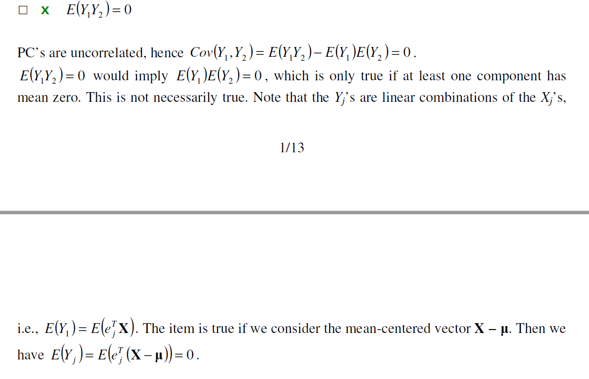
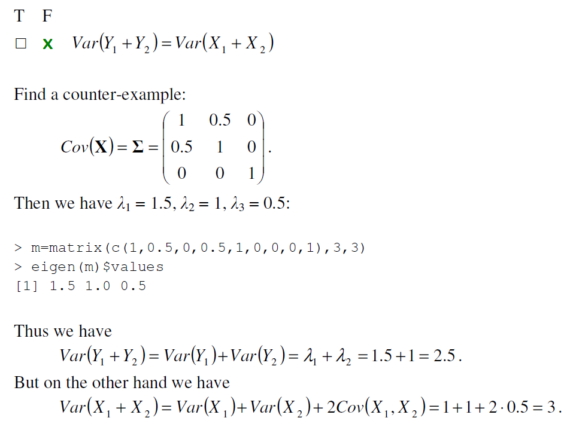
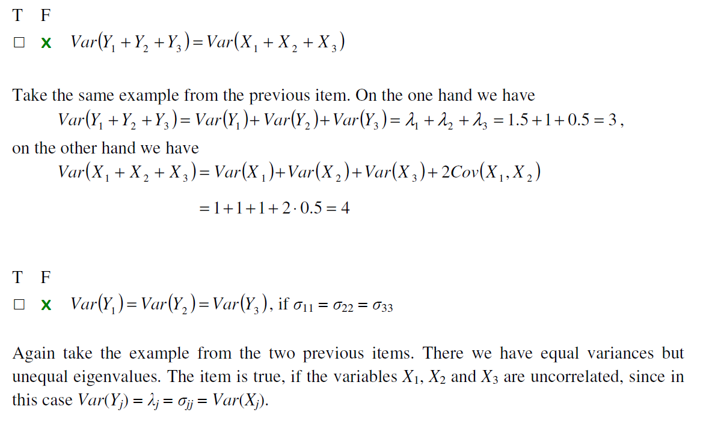

[Back to menu](/README.md)

<h1 id = "0">Notes 4</h1>

- **Exercise 1**







- Create PCA table: 

```
get_pca_table = function(pca, Matrix, size) {
    print(summary(pca, loadings = T))
    E = eigen(Matrix)
    print("The eigenvalues: ")
    print(E$values)

    rho = matrix(data = NA, size, size)
    for (i in 1:size) {
        for (j in 1:size) {
            rho[i, j] = E$vectors[i, j] * sqrt(E$values[j]) / sqrt(Matrix[i, i])
        }
    }
    print("The correlation coefficients between PCs and variables: ")
    print(rho)
}

pca_cov = princomp(covmat = Sigma)
get_pca_table(pca_cov, Sigma, 4)
```


[Back to Top](#0)